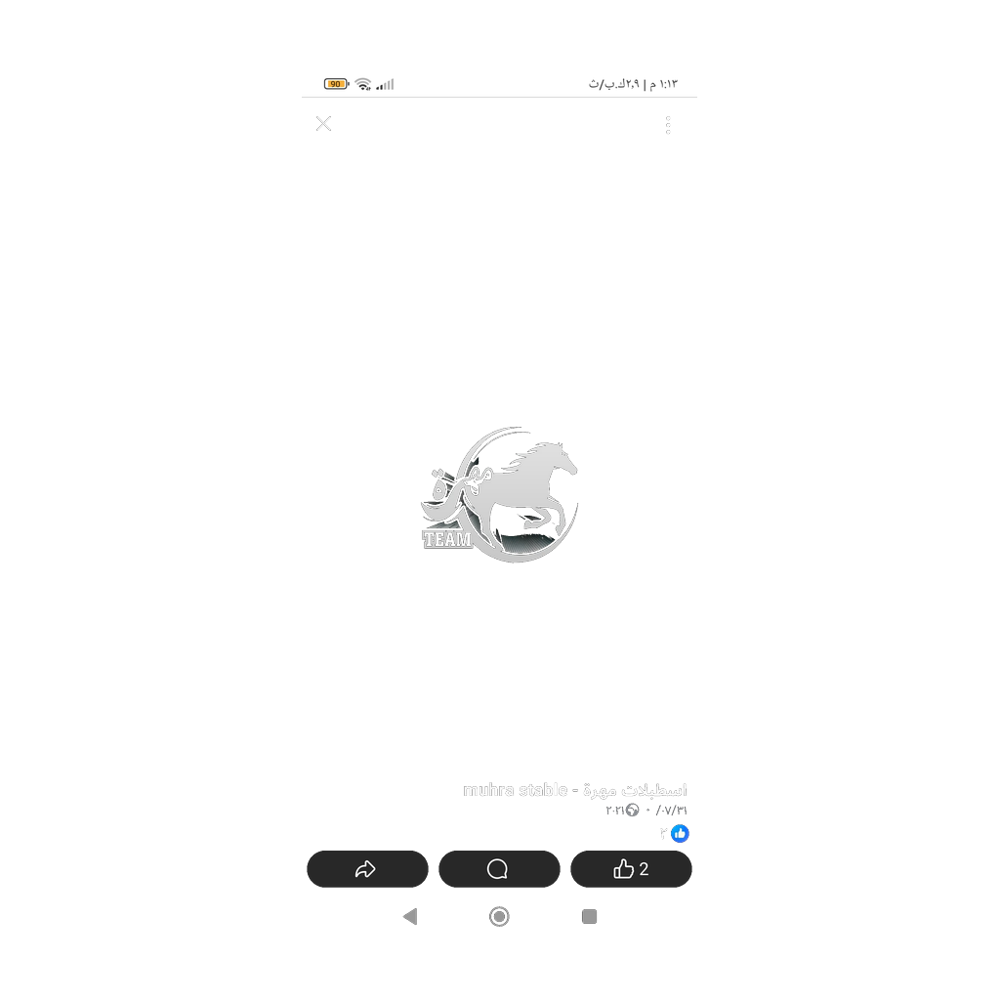

# 🌐 Mikrotik Manager

<div align="center">



**نظام إدارة متقدم لأجهزة MikroTik RouterOS**

[](https://flutter.dev)
[](LICENSE)
[](https://flutter.dev)

</div>

---

## 📱 حول التطبيق

**Mikrotik Manager** هو تطبيق شامل لإدارة أجهزة MikroTik RouterOS بواجهة عربية سهلة الاستخدام. يوفر التطبيق أدوات متقدمة لإدارة المستخدمين، الكروت، المراقبة، والتشخيص.

### ✨ المميزات الرئيسية

#### 🎯 إدارة المستخدمين والكروت
- ✅ إضافة وتعديل وحذف المستخدمين
- ✅ إدارة كروت الإنترنت (Cards Management)
- ✅ إضافة كروت جماعية (Bulk Add)
- ✅ استخراج الكروت من الصور باستخدام OCR
- ✅ توليد كروت PDF قابلة للطباعة

#### 📊 المراقبة والإحصائيات
- ✅ لوحة معلومات النظام (System Dashboard)
- ✅ مراقبة المستخدمين النشطين
- ✅ إحصائيات الاستخدام والبيانات
- ✅ رسوم بيانية تفاعلية (Charts)

#### 🔧 أدوات الشبكة
- ✅ فاحص صحة الشبكة (Network Doctor)
- ✅ كشف خوادم DHCP المارقة (Rogue DHCP Detector)
- ✅ مراقبة الأجهزة (Device Monitoring)
- ✅ خريطة الشبكة (Network Map)

#### 💾 النسخ الاحتياطي والإعدادات
- ✅ نظام نسخ احتياطي متقدم
- ✅ إدارة قوالب PDF
- ✅ حفظ الملفات محلياً
- ✅ مشاركة البيانات

---

## 🚀 التثبيت والاستخدام

### 📥 تحميل التطبيق

#### Android
1. اذهب إلى [Releases](https://github.com/Nassaralshabi/MikroTikfinal007/releases)
2. حمّل آخر إصدار من ملف **APK**
3. فعّل "التثبيت من مصادر غير معروفة" في إعدادات الجهاز
4. ثبّت التطبيق

#### Web
- قريباً: رابط النسخة الويب

#### Desktop (Windows/Linux)
- متوفر في صفحة [Releases](https://github.com/Nassaralshabi/MikroTikfinal007/releases)

---

## 🛠️ للمطورين

### المتطلبات
- **Flutter SDK**: 3.24.0 أو أحدث
- **Dart SDK**: 3.3.0 أو أحدث
- **Android Studio / VS Code** مع ملحقات Flutter
- **Java JDK**: 17 (لبناء Android)

### إعداد المشروع

```bash
# 1. استنساخ المشروع
git clone https://github.com/Nassaralshabi/MikroTikfinal007.git
cd MikroTikfinal007

# 2. تثبيت Dependencies
flutter pub get

# 3. توليد أيقونات التطبيق
flutter pub run flutter_launcher_icons

# 4. تشغيل التطبيق
flutter run
```

### بناء التطبيق محلياً

#### Android APK
```bash
# Fat APK (ملف واحد لجميع المعالجات)
flutter build apk --release

# Split APKs (ملف منفصل لكل معالج)
flutter build apk --split-per-abi --release
```

#### Android App Bundle (للـ Play Store)
```bash
flutter build appbundle --release
```

#### Web
```bash
flutter build web --release
```

#### Windows
```bash
flutter build windows --release
```

#### Linux
```bash
flutter build linux --release
```

---

## 🤖 GitHub Actions - البناء التلقائي

يدعم المشروع **GitHub Actions** للبناء التلقائي لجميع المنصات!

### ⚡ بناء APK تلقائياً

**يتم البناء تلقائياً عند:**
- Push إلى فرع `main` أو `develop`
- فتح Pull Request

**أو التشغيل اليدوي:**
1. اذهب إلى **Actions** → **"Build Android Release APK"**
2. اضغط **"Run workflow"**
3. اختر نوع البناء (Fat APK / Split APKs)
4. حمّل الملفات من **Artifacts**

📖 **للمزيد**: [HOW_TO_BUILD_APK.md](HOW_TO_BUILD_APK.md)

### 🎯 إنشاء إصدار رسمي

```bash
# 1. حدّث رقم الإصدار في pubspec.yaml
version: 1.0.0+1

# 2. أنشئ tag وادفعه
git tag v1.0.0
git push origin v1.0.0

# سيتم إنشاء Release تلقائياً مع:
# - Android APK & AAB
# - Windows EXE
# - Linux Bundle
# - Web Bundle
```

📖 **دليل شامل**: [.github/workflows/WORKFLOWS_GUIDE.md](.github/workflows/WORKFLOWS_GUIDE.md)

---

## 📦 التبعيات الرئيسية

| المكتبة | الاستخدام |
|---------|----------|
| `router_os_client` | الاتصال بـ MikroTik RouterOS API |
| `mqtt_client` | بروتوكول MQTT للاتصالات |
| `fl_chart` | الرسوم البيانية التفاعلية |
| `pdf` & `printing` | توليد وطباعة PDF |
| `google_mlkit_text_recognition` | استخراج النصوص من الصور (OCR) |
| `image_picker` & `camera` | التقاط ومعالجة الصور |
| `provider` | إدارة الحالة |
| `shared_preferences` | حفظ البيانات محلياً |

للقائمة الكاملة: [pubspec.yaml](pubspec.yaml)

---

## 🎨 لقطات الشاشة

<div align="center">

| الشاشة الرئيسية | لوحة المعلومات | إدارة المستخدمين |
|:---------------:|:--------------:|:----------------:|
|  |  |  |

</div>

---

## 🏗️ البنية المعمارية

```
lib/
├── main.dart                          # نقطة البداية
├── mikrotik_connector.dart            # الاتصال بـ MikroTik API
├── mqtt_service.dart                  # خدمة MQTT
│
├── Screens/
│   ├── active_users_screen.dart       # المستخدمون النشطون
│   ├── system_dashboard_screen.dart   # لوحة المعلومات
│   ├── card_list_screen.dart          # قائمة الكروت
│   ├── backup_system_screen.dart      # النسخ الاحتياطي
│   ├── network_doctor_screen.dart     # فاحص الشبكة
│   └── ...
│
├── Services/
│   ├── pdf_generator.dart             # توليد PDF
│   ├── bulk_add_isolate.dart          # معالجة متعددة العمليات
│   └── snackbar_helpers.dart          # رسائل التنبيه
│
└── assets/
    ├── images/                        # الصور
    └── icon/                          # أيقونات التطبيق
```

---

## 🤝 المساهمة

نرحب بجميع المساهمات! يرجى اتباع الخطوات التالية:

1. Fork المشروع
2. أنشئ فرع جديد (`git checkout -b feature/amazing-feature`)
3. Commit التغييرات (`git commit -m 'Add amazing feature'`)
4. Push للفرع (`git push origin feature/amazing-feature`)
5. افتح Pull Request

---

## 📄 الرخصة

هذا المشروع مرخص تحت [MIT License](LICENSE).

---

## 📞 التواصل والدعم

- **المطور**: Nassar Alshabi
- **GitHub**: [@Nassaralshabi](https://github.com/Nassaralshabi)
- **Issues**: [GitHub Issues](https://github.com/Nassaralshabi/MikroTikfinal007/issues)

---

## 🙏 شكر وتقدير

- فريق Flutter على الإطار الرائع
- مجتمع MikroTik على الدعم والموارد
- جميع المساهمين في المكتبات مفتوحة المصدر المستخدمة

---

<div align="center">

**صُنع بـ ❤️ في المملكة العربية السعودية**

[](https://github.com/Nassaralshabi/MikroTikfinal007)

</div>
